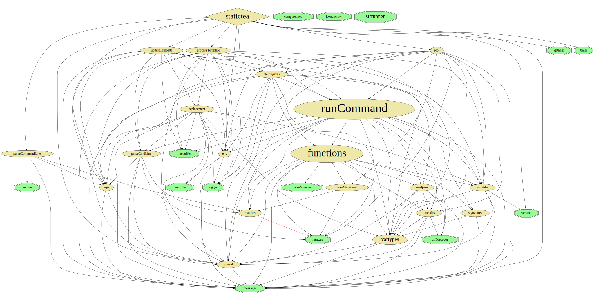

Module Dependencies
===================

The module dependencies graph shows the dependencies between
the StaticTea modules; which modules are imported and used by
other modules. The size is proportional to the module file
size. Green modules don't include other modules.

Nim Module Usage
================

The graph shows the nim modules on the left and the StaticTea
modules on the right. The arrows tell which StaticTea module
imports which nim module.

.. image:: staticteadep2.svg
