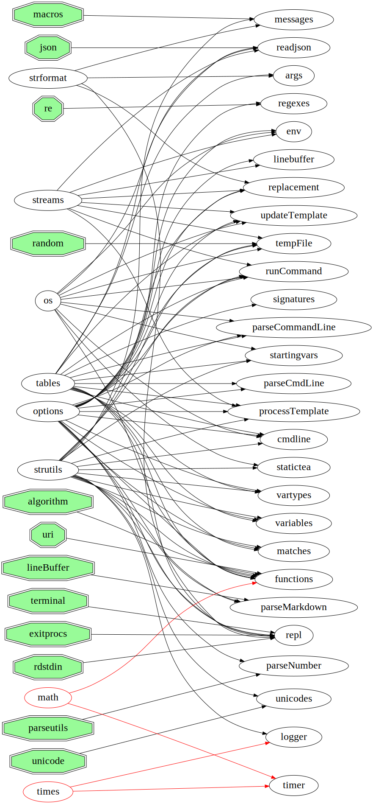

# StaticTea Modules

StaticTea nim source code documentation.

* [args.nim](args.md) &mdash; Types for handling command line arguments.
* [cmdline.nim](cmdline.md) &mdash; Parse the command line.
* [codefile.nim](codefile.md) &mdash; Run code files.
* [collectCommand.nim](collectCommand.md) &mdash; Collect template command lines.
* [comparelines.nim](comparelines.md) &mdash; Compare lines of text.
* [env.nim](env.md) &mdash; Environment holding the input and output streams.
* [funtypes.nim](funtypes.md) &mdash; Statictea function types and supporting routines.
* [gethelp.nim](gethelp.md) &mdash; Get the command line help message.
* [matches.nim](matches.md) &mdash; Regular expression matching methods.
* [messages.nim](messages.md) &mdash; Messages IDs and associated strings.
* [opresult.nim](opresult.md) &mdash; OpResult holds either a value or a message.
* [opresultid.nim](opresultid.md) &mdash; OpResultId holds either a value or a message id.
* [opresultwarn.nim](opresultwarn.md) &mdash; OpResultWarn holds either a value or warning data.
* [parseCmdLine.nim](parseCmdLine.md) &mdash; Parse a StaticTea language command line.
* [parseCommandLine.nim](parseCommandLine.md) &mdash; Parse the StaticTea terminal command line and return the arguments.
* [parseNumber.nim](parseNumber.md) &mdash; Parse an int or float number string.
* [processTemplate.nim](processTemplate.md) &mdash; Process the template.
* [readjson.nim](readjson.md) &mdash; Read json content.
* [readlines.nim](readlines.md) &mdash; Read lines from a stream without exceeding the maximum line
length.
* [regexes.nim](regexes.md) &mdash; Perl regular expression matching.
* [replacement.nim](replacement.md) &mdash; Handle the replacement block lines.
* [runCommand.nim](runCommand.md) &mdash; Run a command and fill in the variables dictionaries.
* [runFunction.nim](runFunction.md) &mdash; This module contains the StaticTea functions and supporting types.
* [runner.nim](runner.md) &mdash; A standalone command to run Single Test File (stf) files.
* [signatures.nim](signatures.md) &mdash; Statictea function signatures and parameter checking.
* [statictea.nim](statictea.md) &mdash; StaticTea; A template processor and language.
* [tempFile.nim](tempFile.md) &mdash; Create a temporary file.
* [timer.nim](timer.md) &mdash; Time how long it takes something to run.
* [unicodes.nim](unicodes.md) &mdash; Functions that deal with Unicode.
* [utf8decoder.nim](utf8decoder.md) &mdash; Functions for decoding and validating UTF-8.
* [variables.nim](variables.md) &mdash; Procedures for working with statictea variables.
* [vartypes.nim](vartypes.md) &mdash; StaticTea variable types.
* [version.nim](version.md) &mdash; The current StaticTea version number.
* [warnings.nim](warnings.md) &mdash; Module for handling warnings.

# Nim Module Usage

---
⦿ Markdown page generated by [StaticTea](https://github.com/flenniken/statictea/) from nim doc comments. ⦿
