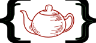

# Statictea Functions

The built-in Statictea functions.

Functions allow you to format variables for presentation in a
replacement block.  They return a value that you assign to a
variable or pass to another function.

# Index

* [add](#add) &mdash; Add two floats.
* [add](#add-1) &mdash; Add two integers.
* [anchors](#anchors) &mdash; Create anchor names from heading names.
* [and](#and) &mdash; Boolean AND with short circuit.
* [bool](#bool) &mdash; Create an bool from a value.
* [case](#case) &mdash; Compare integer cases and return the matching value.
* [case](#case-1) &mdash; Compare string cases and return the matching value.
* [cmp](#cmp) &mdash; Compare two floats.
* [cmp](#cmp-1) &mdash; Compare two ints.
* [cmp](#cmp-2) &mdash; Compare two strings.
* [cmpVersion](#cmpversion) &mdash; Compare two StaticTea version numbers.
* [concat](#concat) &mdash; Concatenate two strings.
* [dict](#dict) &mdash; Create a dictionary from a list of key, value pairs.
* [dup](#dup) &mdash; Duplicate a string x times.
* [eq](#eq) &mdash; Return true when two floats are equal.
* [eq](#eq-1) &mdash; Return true when the two ints are equal.
* [eq](#eq-2) &mdash; Return true when two strings are equal.
* [exists](#exists) &mdash; Determine whether a key exists in a dictionary.
* [find](#find) &mdash; Find the position of a substring in a string.
* [float](#float) &mdash; Create a float from an int.
* [float](#float-1) &mdash; Create a float from a number string.
* [float](#float-2) &mdash; Create a float from a number string.
* [format](#format) &mdash; Format a string using replacement variables similar to a replacement block.
* [func](#func) &mdash; Define a function.
* [functionDetails](#functiondetails) &mdash; Return the function details in a dictionary.
* [get](#get) &mdash; Get a dictionary value by its key.
* [get](#get-1) &mdash; Get a list value by its index.
* [gt](#gt) &mdash; Return true when one float is greater than another float.
* [gt](#gt-1) &mdash; Return true when an int is greater then another int.
* [gte](#gte) &mdash; Return true when a float is greater than or equal to another float.
* [gte](#gte-1) &mdash; Return true when an int is greater then or equal to another int.
* [highlight](#highlight) &mdash; Divide a string of StaticTea code into fragments useful for syntax highlighting.
* [html](#html) &mdash; Escape text for placing it in an html page.
* [if0](#if0) &mdash; If the condition is 0, return the second argument, else return the third argument.
* [if](#if) &mdash; If the condition is true, return the second argument, else return the third argument.
* [int](#int) &mdash; Create an int from a float.
* [int](#int-1) &mdash; Create an int from a number string.
* [int](#int-2) &mdash; Create an int from a number string.
* [join](#join) &mdash; Join a list of strings with a separator.
* [joinPath](#joinpath) &mdash; Join the path components with a path separator.
* [keys](#keys) &mdash; Create a list from the keys in a dictionary.
* [len](#len) &mdash; Number of elements in a dictionary.
* [len](#len-1) &mdash; Number of elements in a list.
* [len](#len-2) &mdash; Number of unicode characters in a string.
* [list](#list) &mdash; Create a list of variables.
* [listLoop](#listloop) &mdash; Loop over items in a list and fill in a container.
* [log](#log) &mdash; Log a message to the log file.
* [lower](#lower) &mdash; Lowercase a string.
* [lt](#lt) &mdash; Return true when a float is less then another float.
* [lt](#lt-1) &mdash; Return true when an int is less than another int.
* [lte](#lte) &mdash; Return true when a float is less than or equal to another float.
* [lte](#lte-1) &mdash; Return true when an int is less than or equal to another int.
* [markdownLite](#markdownlite) &mdash; Parse a simple subset of markdown which contains paragraphs, bullets and code blocks.
* [ne](#ne) &mdash; Return true when two floats are not equal.
* [ne](#ne-1) &mdash; Return true when two ints are not equal.
* [ne](#ne-2) &mdash; Return true when two strings are not equal.
* [not](#not) &mdash; Boolean not.
* [or](#or) &mdash; Boolean OR with short circuit.
* [path](#path) &mdash; Split a file path into its component pieces.
* [readJson](#readjson) &mdash; Convert a JSON string to a variable.
* [replace](#replace) &mdash; Replace a substring specified by its position and length with another string.
* [replaceRe](#replacere) &mdash; Replace multiple parts of a string using regular expressions.
* [return](#return) &mdash; Return is a special function that returns the value passed in and has has side effects.
* [slice](#slice) &mdash; Extract a substring from a string by its position and length.
* [sort](#sort) &mdash; Sort a list of values of the same type.
* [sort](#sort-1) &mdash; Sort a list of lists.
* [sort](#sort-2) &mdash; Sort a list of dictionaries.
* [startsWith](#startswith) &mdash; Check whether a strings starts with the given prefix.
* [string](#string) &mdash; Convert a variable to a string.
* [string](#string-1) &mdash; Convert the dictionary variable to dot names.
* [sub](#sub) &mdash; Subtract two floats.
* [sub](#sub-1) &mdash; Subtract two integers.
* [type](#type) &mdash; Return the argument type, one of: int, float, string, list, dict, bool or func.
* [values](#values) &mdash; Create a list out of the values in the specified dictionary.
* [warn](#warn) &mdash; Return a warning message and skip the current statement.

# add

Add two floats. A warning is generated on overflow.

~~~
add = func(a: float, b: float) float
~~~

Examples:

~~~
add(1.5, 2.3) => 3.8
add(3.2, -2.2) => 1.0
~~~

# add

Add two integers. A warning is generated on overflow.

~~~
add = func(a: int, b: int) int
~~~

Examples:

~~~
add(1, 2) => 3
add(3, -2) => 1
add(-2, -5) => -7
~~~

# anchors

Create anchor names from heading names. Use it for HTML class names or Github markdown internal links. It handles duplicate heading names.

~~~
anchors = func(names: list, type: string) list
~~~

type:

* html -- HTML class names
* github -- GitHub markdown anchor links

Examples:

~~~
list = list("Tea", "Water", "Tea")
anchores(list, "github") =>
  ["tea", "water", "tea-1"]
~~~

# and

Boolean AND with short circuit. If the first argument is false, the second argument is not evaluated.

~~~
and = func(a: bool, b: bool) bool
~~~

Examples:

~~~
and(true, true) => true
and(false, true) => false
and(true, false) => false
and(false, false) => false
and(false, warn("not hit")) => false
~~~

# bool

Create an bool from a value.

~~~
bool = func(value: Value) bool
~~~

False values by variable types:

* bool -- false
* int -- 0
* float -- 0.0
* string -- when the length of the string is 0
* list -- when the length of the list is 0
* dict -- when the length of the dictionary is 0
* func -- always false

Examples:

~~~
bool(0) => false
bool(0.0) => false
bool([]) => false
bool("") => false
bool(dict()) => false

bool(5) => true
bool(3.3) => true
bool([8]) => true
bool("tea") => true
bool(dict("tea", 2)) => true
~~~

# case

Compare integer cases and return the matching value.  It takes a main integer condition, a list of case pairs and an optional value when none of the cases match.

The first element of a case pair is the condition and the
second is the return value when that condition matches the main
condition. The function compares the conditions left to right and
returns the first match.

When none of the cases match the main condition, the default
value is returned if it is specified, otherwise a warning is
generated.  The conditions must be integers. The return values
can be any type.

~~~
case = case(condition: int, pairs: list, default: optional any) any
~~~

Examples:

~~~
cases = list(0, "tea", 1, "water", 2, "beer")
case(0, cases) => "tea"
case(1, cases) => "water"
case(2, cases) => "beer"
case(2, cases, "wine") => "beer"
case(3, cases, "wine") => "wine"
~~~

# case

Compare string cases and return the matching value.  It takes a main string condition, a list of case pairs and an optional value when none of the cases match.

The first element of a case pair is the condition and the
second is the return value when that condition matches the main
condition. The function compares the conditions left to right and
returns the first match.

When none of the cases match the main condition, the default
value is returned if it is specified, otherwise a warning is
generated.  The conditions must be strings. The return values
can be any type.

~~~
case = func(condition: string, pairs: list, default: optional any) any
~~~

Examples:

~~~
cases = list("tea", 15, "water", 2.3, "beer", "cold")
case("tea", cases) => 15
case("water", cases) => 2.3
case("beer", cases) => "cold"
case("bunch", cases, "other") => "other"
~~~

# cmp

Compare two floats. Returns -1 for less, 0 for equal and 1 for greater than.

~~~
cmp = func(a: float, b: float) int
~~~

Examples:

~~~
cmp(7.8, 9.1) => -1
cmp(8.4, 8.4) => 0
cmp(9.3, 2.2) => 1
~~~

# cmp

Compare two ints. Returns -1 for less, 0 for equal and 1 for greater than.

~~~
cmp = func(a: int, b: int) int
~~~

Examples:

~~~
cmp(7, 9) => -1
cmp(8, 8) => 0
cmp(9, 2) => 1
~~~

# cmp

Compare two strings. Returns -1 for less, 0 for equal and 1 for greater than.

You have the option to compare case insensitive. Case sensitive
is the default.

~~~
cmp = func(a: string, b: string, insensitive: optional bool) int
~~~

Examples:

~~~
cmp("coffee", "tea") => -1
cmp("tea", "tea") => 0
cmp("Tea", "tea") => 1
cmp("Tea", "tea", true) => 1
cmp("Tea", "tea", false) => 0
~~~

# cmpVersion

Compare two StaticTea version numbers. Returns -1 for less, 0 for equal and 1 for greater than.

~~~
cmpVersion = func(versionA: string, versionB: string) int
~~~

StaticTea uses [[https://semver.org/][Semantic Versioning]]
with the added restriction that each version component has one
to three digits (no letters).

Examples:

~~~
cmpVersion("1.2.5", "1.1.8") => 1
cmpVersion("1.2.5", "1.3.0") => -1
cmpVersion("1.2.5", "1.2.5") => 0
~~~

# concat

Concatenate two strings. See the join function for more that two arguments.

~~~
concat = func(a: string, b: string) string
~~~

Examples:

~~~
concat("tea", " time") => "tea time"
concat("a", "b") => "ab"
~~~

# dict

Create a dictionary from a list of key, value pairs.  The keys must be strings and the values can be any type.

~~~
dict = func(pairs: optional list) dict
~~~

Examples:

~~~
dict() => {}
dict(["a", 5]) => {"a": 5}
dict(["a", 5, "b", 33, "c", 0]) =>
  {"a": 5, "b": 33, "c": 0}
~~~

# dup

Duplicate a string x times.  The result is a new string built by concatenating the string to itself the specified number of times.

~~~
dup = func(pattern: string, count: int) string
~~~

Examples:

~~~
dup("=", 3) => "==="
dup("abc", 0) => ""
dup("abc", 1) => "abc"
dup("abc", 2) => "abcabc"
dup("", 3) => ""
~~~

# eq

Return true when two floats are equal.

~~~
eq(a: float, b: float) bool
~~~

Examples:

~~~
eq(1.2, 1.2) => true
eq(1.2, 3.2) => false
~~~

# eq

Return true when the two ints are equal.

~~~
eq = func(a: int, b: int) bool
~~~

Examples:

~~~
eq(1, 1) => true
eq(2, 3) => false
~~~

# eq

Return true when two strings are equal.  See cmp function for case insensitive compare.

~~~
eq = func(a: string, b: string) bool
~~~

Examples:

~~~
eq("tea", "tea") => true
eq("1.2", "3.2") => false
~~~

# exists

Determine whether a key exists in a dictionary. Return true when it exists, else false.

~~~
exists = func(dictionary: dict, key: string) bool
~~~

Examples:

~~~
d = dict("tea", "Earl")
exists(d, "tea") => true
exists(d, "coffee") => false
~~~

# find

Find the position of a substring in a string.  When the substring is not found, return an optional default value.  A warning is generated when the substring is missing and you don't specify a default value.

~~~
find = func(str: string, substring: string, default: optional any) any
~~~

Examples:

~~~
       0123456789 1234567
msg = "Tea time at 3:30."
find(msg, "Tea") = 0
find(msg, "time") = 4
find(msg, "me") = 6
find(msg, "party", -1) = -1
find(msg, "party", len(msg)) = 17
find(msg, "party", 0) = 0
~~~

# float

Create a float from an int.

~~~
float = func(num: int) float
~~~

Examples:

~~~
float(2) => 2.0
float(-33) => -33.0
~~~

# float

Create a float from a number string. If the string is not a number, return the default.

~~~
float = func(numString: string, default: optional any) any
~~~

Examples:

~~~
float("2") => 2.0
float("notnum", "nan") => nan
~~~

# float

Create a float from a number string.

~~~
float = func(numString: string) float
~~~

Examples:

~~~
float("2") => 2.0
float("2.4") => 2.4
float("33") => 33.0
~~~

# format

Format a string using replacement variables similar to a replacement block. To enter a left bracket use two in a row.

~~~
format = func(str: string) string
~~~

Example:

~~~
let first = "Earl"
let last = "Grey"
str = format("name: {first} {last}")

str => "name: Earl Grey"
~~~

To enter a left bracket use two in a row.

~~~
str = format("use two {{ to get one")

str => "use two { to get one"
~~~

# func

Define a function.

~~~
func = func(signature: string) func
~~~

Example:

~~~
mycmp = func(numStr1: string, numStr2: string) int
  ## Compare two number strings
  ## and return 1, 0, or -1.
  num1 = int(numStr1)
  num2 = int(numStr2)
  return(cmp(num1, num2))
~~~

# functionDetails

Return the function details in a dictionary.

~~~
functionDetails = func(funcVar: func) dict
~~~

The following example defines a simple function then gets its
function details.

~~~
mycmp = func(numStr1: string, numStr2: string) int
  ## Compare two number strings and return 1, 0, or -1.
  return(cmp(int(numStr1), int(numStr2)))

fd = functionDetails(mycmp)

fd =>
fd.builtIn = false
fd.signature.optional = false
fd.signature.name = "strNumCmp"
fd.signature.paramNames = ["numStr1","numStr2"]
fd.signature.paramTypes = ["string","string"]
fd.signature.returnType = "int"
fd.docComment = "  ## Compare two number strings and return 1, 0, or -1.\n"
fd.filename = "testcode.tea"
fd.lineNum = 3
fd.numLines = 2
fd.statements = ["  return(cmp(int(numStr1), int(numStr2)))"]
~~~

# get

Get a dictionary value by its key.  If the key doesn't exist, the default value is returned if specified, else a warning is generated.

~~~
get = func(dictionary: dict, key: string, default: optional any) any
~~~

Note: For dictionary lookup you can use dot notation. It's the
same as get without the default.

Examples:

~~~
d = dict("tea", "Earl Grey")
get(d, "tea") => "Earl Grey"
get(d, "coffee", "Tea") => "Tea"
~~~

Using dot notation:
~~~
d = dict("tea", "Earl Grey")
d.tea => "Earl Grey"
~~~

# get

Get a list value by its index.  If the index is invalid, the default value is returned when specified, else a warning is generated. You can use negative index values. Index -1 gets the last element. It is short hand for len - 1. Index -2 is len - 2, etc.

~~~
get = func(list: list, index: int, default: optional any) any
~~~

Examples:

~~~
list = list(4, "a", 10)
get(list, 0) => 4
get(list, 1) => "a"
get(list, 2) => 10
get(list, 3, 99) => 99
get(list, -1) => 10
get(list, -2) => "a"
get(list, -3) => 4
get(list, -4, 11) => 11
~~~

You can also use bracket notation to access list items.

~~~
a = teas[0]
~~~

# gt

Return true when one float is greater than another float.

~~~
gt = func(a: float, b: float) bool
~~~

Examples:

~~~
gt(2.8, 4.3) => false
gt(3.1, 2.5) => true
~~~

# gt

Return true when an int is greater then another int.

~~~
gt = func(a: int, b: int) bool
~~~

Examples:

~~~
gt(2, 4) => false
gt(3, 2) => true
~~~

# gte

Return true when a float is greater than or equal to another float.

~~~
gte = func(a: float, b: float) bool
~~~

Examples:

~~~
gte(2.8, 4.3) => false
gte(3.1, 3.1) => true
~~~

# gte

Return true when an int is greater then or equal to another int.

~~~
gte = func(a: int, b: int) bool
~~~

Examples:

~~~
gte(2, 4) => false
gte(3, 3) => true
~~~

# highlight

Divide a string of StaticTea code into fragments useful for syntax highlighting.  Return a list of tagged fragments.

~~~
highlight = func(code: string) list
~~~

Tags:

* other -- not one of the other types
* dotName -- a dot name
* funcCall -- a function call; a dot name followed by a left parenthesis
* num -- a literal number
* str -- a literal string
* multiline -- a multiline literal string
* doc -- a doc comment
* comment -- a comment
* param -- a parameter name
* type -- int, float, string, list, dict, bool, func, any and optional

Example:

~~~
frags = highlight("a = 5")
frags => [
  ["dotName", "a"],
  ["other", " = "],
  ["num", "5"],
]
~~~

# html

Escape text for placing it in an html page.

~~~
html = func(text: string, place: string) string
~~~

places:

* body -- in the html body
* attribute -- in an html attribute

~~~
name = html("Mad <Hatter>", "body")
  => "Mad &lt;Hatter&gt;"
~~~

For more information about how to escape and what is safe see:
[[https://cheatsheetseries.owasp.org/cheatsheets/Cross_Site_Scripting_Prevention_Cheat_Sheet.html#output-encoding-for-html-contexts][XSS]]

# if0

If the condition is 0, return the second argument, else return the third argument.  You can use any type for the condition.  The condition is 0 for strings, lists and dictionaries when their length is 0.

The condition types and what is considered 0:

* bool -- false
* int -- 0
* float -- 0.0
* string -- when the length of the string is 0
* list -- when the length of the list is 0
* dict -- when the length of the dictionary is 0
* func -- always 0

The IF functions are special in a couple of ways, see
the If Functions section.

~~~
if0 = func(condition: any, then: any, else: optional any) any
~~~

Examples:

~~~
a = if0(0, "tea", "beer") => tea
a = if0(1, "tea", "beer") => beer
a = if0(4, "tea", "beer") => beer
a = if0("", "tea", "beer") => tea
a = if0("abc", "tea", "beer") => beer
a = if0([], "tea", "beer") => tea
a = if0([1,2], "tea", "beer") => beer
a = if0(dict(), "tea", "beer") => tea
a = if0(dict("a",1), "tea", "beer") => beer
a = if0(false, "tea", "beer") => tea
a = if0(true, "tea", "beer") => beer
a = if0(true, "tea")
a = if0(false, "tea")
~~~

You don't have to assign the result of an if0 function which is
useful when using a warn or return function for its side effects.
The if takes two arguments when there is no assignment.

~~~
if0(c, warn("got zero value"))
~~~

# if

If the condition is true, return the second argument, else return the third argument.

The IF functions are special in a couple of ways, see
the If Functions section.  You usually use boolean infix
expressions for the condition, see:
the Boolean Expressions section.

~~~
if = func(condition: bool, then: any, else: optional any) any
~~~

Examples:

~~~
a = if(true, "tea", "beer") # => tea
b = if(false, "tea", "beer") # => beer
c = if((v < 5), "tea", "beer")
d = if((v < 5), "tea")
~~~

You don't have to assign the result of an if function which is
useful when using a warn or return function for its side effects.
The if takes two arguments when there is no assignment.

~~~
if(c, warn("c is true"))
if(c, return("skip"))
~~~

# int

Create an int from a float.

~~~
int = func(num: float, roundOption: optional string) int
~~~

Round options:

* "round" - nearest integer, the default.
* "floor" - integer below (to the left on number line)
* "ceiling" - integer above (to the right on number line)
* "truncate" - remove decimals

Examples:

~~~
int(2.34) => 2
int(2.34, "round") => 2
int(-2.34, "round") => -2
int(6.5, "round") => 7
int(-6.5, "round") => -7
int(4.57, "floor") => 4
int(-4.57, "floor") => -5
int(6.3, "ceiling") => 7
int(-6.3, "ceiling") => -6
int(6.3456, "truncate") => 6
int(-6.3456, "truncate") => -6
~~~

# int

Create an int from a number string.

~~~
int = func(numString: string, roundOption: optional string) int
~~~

Round options:

* "round" - nearest integer, the default
* "floor" - integer below (to the left on number line)
* "ceiling" - integer above (to the right on number line)
* "truncate" - remove decimals

Examples:

~~~
int("2") => 2
int("2.34") => 2
int("-2.34", "round") => -2
int("6.5", "round") => 7
int("-6.5", "round") => -7
int("4.57", "floor") => 4
int("-4.57", "floor") => -5
int("6.3", "ceiling") => 7
int("-6.3", "ceiling") => -6
int("6.3456", "truncate") => 6
int("-6.3456", "truncate") => -6
~~~

# int

Create an int from a number string. If the string is not a number, return the default value.

~~~
int = func(numString: string, roundOption: string, default: optional any) any
~~~

Round options:

* "round" - nearest integer, the default
* "floor" - integer below (to the left on number line)
* "ceiling" - integer above (to the right on number line)
* "truncate" - remove decimals

Examples:

~~~
int("2", "round", "nan") => 2
int("notnum", "round", "nan") => nan
~~~

# join

Join a list of strings with a separator.  An optional parameter determines whether you skip empty strings or not. You can use an empty separator to concatenate the arguments.

~~~
join = func(strs: list, sep: string, skipEmpty: optional bool) string
~~~

Examples:

~~~
join(["a", "b"], ", ") => "a, b"
join(["a", "b"], "") => "ab"
join(["a", "b", "c"], "") => "abc"
join(["a"], ", ") => "a"
join([""], ", ") => ""
join(["a", "b"], "") => "ab"
join(["a", "", "c"], "|") => "a||c"
join(["a", "", "c"], "|", true) => "a|c"
~~~

# joinPath

Join the path components with a path separator.

You pass a list of components to join. For the second optional
parameter you specify the separator to use, either "/", "" or
"". If you specify "" or leave off the parameter, the current
platform separator is used.

If the separator already exists between components, a new one
is not added. If a component is "", the platform separator is
used for it.

~~~
joinPath = func(components: list, separator: optional string) string
~~~

Examples:

~~~
joinPath(["images", "tea"]) =>
  "images/tea"

joinPath(["images", "tea"], "/") =>
  "images/tea"

joinPath(["images", "tea"], "\") =>
  "images\tea"

joinPath(["images/", "tea"]) =>
  "images/tea"

joinPath(["", "tea"]) =>
  "/tea"

joinPath(["/", "tea"]) =>
  "/tea"
~~~

# keys

Create a list from the keys in a dictionary.

~~~
keys = func(dictionary: dict) list
~~~

Examples:

~~~
d = dict("a", 1, "b", 2, "c", 3)
keys(d) => ["a", "b", "c"]
values(d) => [1, 2, 3]
~~~

# len

Number of elements in a dictionary.

~~~
len = func(dictionary: dict) int
~~~

Examples:

~~~
len(dict()) => 0
len(dict("a", 4)) => 1
len(dict("a", 4, "b", 3)) => 2
~~~

# len

Number of elements in a list.

~~~
len = func(list: list) int
~~~

Examples:

~~~
len(list()) => 0
len(list(1)) => 1
len(list(4, 5)) => 2
~~~

# len

Number of unicode characters in a string.

~~~
len = func(str: string) int
~~~

Examples:

~~~
len("tea") => 3
len("añyóng") => 6
~~~

# list

Create a list of variables. You can also create a list with brackets.

~~~
list = func(...) list
~~~

Examples:

~~~
a = list()
a = list(1)
a = list(1, 2, 3)
a = list("a", 5, "b")
a = []
a = [1]
a = [1, 2, 3]
a = ["a", 5, "b"]
~~~

# listLoop

Loop over items in a list and fill in a container. A callback
function is called for each item in the list and it decides what
goes in the container.

You pass a list to loop over, a container to fill in, a
callback function, and an optional state variable. The function
returns whether the callback stopped early or not and you can
ignore it using a bare form.

~~~
listLoop = func(a: list, container: any, listCallback: func, state: optional any) bool
~~~

The callback gets passed the index to the item, its value, the
container and the state variable.  The callback looks at the
information and adds to the container when appropriate. The
callback returns true to stop iterating.

~~~
listCallback = func(ix: int, item: any, container: any, state: optional any) bool
~~~

The following example makes a new list [6, 8] from the list
[2,4,6,8].  The callback is called b5.

~~~
o.container = []
list = [2,4,6,8]
listLoop(list, o.container, b5)
# o.container => [6, 8]
~~~

Below is the definition of the b5 callback function.

~~~
b5 = func(ix: int, value: int, container: list) bool
  ## Collect values greater than 5.
  container &= if( (value > 5), value)
  return(false)
~~~

# log

Log a message to the log file.  You can call the log function without an assignment.

~~~
log = func(message: string) string
~~~

You can log conditionally in a bare if statement:

~~~
if0(c, log("log this message when c is 0"))
~~~

You can log unconditionally using a bare log statement:

~~~
log("always log")
~~~

# lower

Lowercase a string.

~~~
lower = func(str: string) string
~~~

Examples:

~~~
lower("Tea") => "tea"
lower("TEA") => "tea"
lower("TEĀ") => "teā"
~~~

# lt

Return true when a float is less then another float.

~~~
lt = func(a: float, b: float) bool
~~~

Examples:

~~~
lt(2.8, 4.3) => true
lt(3.1, 2.5) => false
~~~

# lt

Return true when an int is less than another int.

~~~
lt = func(a: int, b: int) bool
~~~

Examples:

~~~
gt(2, 4) => true
gt(3, 2) => false
~~~

# lte

Return true when a float is less than or equal to another float.

~~~
lte = func(a: float, b: float) bool
~~~

Examples:

~~~
lte(2.3, 4.4) => true
lte(3.0, 3.0) => true
lte(4.0, 3.0) => false
~~~

# lte

Return true when an int is less than or equal to another int.

~~~
lte = func(a: int, b: int) bool
~~~

Examples:

~~~
lte(2, 4) => true
lte(3, 3) => true
lte(4, 3) => false
~~~

# markdownLite

Parse a simple subset of markdown which contains paragraphs, bullets and code blocks. This subset is used to document all StaticTea functions. Return a list of lists.

~~~
markdownList = func(mdText: string) list
~~~

list elements:

* p -- A paragraph element is one string, possibly containing
newlines.

* code -- A code element is three strings. The first string is
the code start line, for example “~~~” or “~~~nim”.  The second
string (with newlines) contains the text of the block.  The third
string is the ending line, for example “~~~”.

* bullets -- A bullets element contains a string (with newlines)
for each bullet point.  The leading “* “ is not part of the
string.

~~~
elements = markdownLite(description)
elements => [
  ["p", ["the paragraph which may contain newlines"]]
  ["code", ["~~~", "code text with newlines", "~~~"]]
  ["bullets", ["bullet (newlines) 1", "point 2", "3", ...]
]
~~~

# ne

Return true when two floats are not equal.

~~~
ne = func(a: float, b: float) bool
~~~

Examples:

~~~
ne(1.2, 1.2) => false
ne(1.2, 3.2) => true
~~~

# ne

Return true when two ints are not equal.

~~~
ne = func(a: int, b: int) bool
~~~

Examples:

~~~
ne(1, 1) => false
ne(2, 3) => true
~~~

# ne

Return true when two strings are not equal.

~~~
ne(a: string, b: string) bool
~~~

Examples:

~~~
ne("tea", "tea") => false
ne("earl", "grey") => true
~~~

# not

Boolean not.

~~~
not = func(value: bool) bool
~~~

Examples:

~~~
not(true) => false
not(false) => true
~~~

# or

Boolean OR with short circuit. If the first argument is true, the second argument is not evaluated.

~~~
or = func(a: bool, b: bool) bool
~~~

Examples:

~~~
or(true, true) => true
or(false, true) => true
or(true, false) => true
or(false, false) => false
or(true, warn("not hit")) => true
~~~

# path

Split a file path into its component pieces. Return a dictionary with the filename, basename, extension and directory.

You pass a path string and the optional path separator, forward
slash or or backslash. When no separator, the current
system separator is used.

~~~
path = func(filename: string, separator: optional string) dict
~~~

Examples:

~~~
path("src/functions.nim") => {
  "filename": "functions.nim",
  "basename": "functions",
  "ext": ".nim",
  "dir": "src/",
}

path("src\functions.nim", "\") => {
  "filename": "functions.nim",
  "basename": "functions",
  "ext": ".nim",
  "dir": "src\",
}
~~~

# readJson

Convert a JSON string to a variable.

~~~
readJson = func(json: string) any
~~~

Examples:

~~~
a = readJson("\"tea\"") => "tea"
b = readJson("4.5") => 4.5
c = readJson("[1,2,3]") => [1, 2, 3]
d = readJson("{\"a\":1, \"b\": 2}")
  => {"a": 1, "b", 2}
~~~

# replace

Replace a substring specified by its position and length with another string.  You can use the function to insert and append to a string as well.

~~~
replace = func(str: string, start: int, length: int, replacement: string) string
~~~

* str: string
* start: substring start index
* length: substring length
* replacement: substring replacement

Examples:

Replace:
~~~
replace("Earl Grey", 5, 4, "of Sandwich")
  => "Earl of Sandwich"
replace("123", 0, 1, "abcd") => abcd23
replace("123", 0, 2, "abcd") => abcd3

replace("123", 1, 1, "abcd") => 1abcd3
replace("123", 1, 2, "abcd") => 1abcd

replace("123", 2, 1, "abcd") => 12abcd
~~~
Insert:
~~~
replace("123", 0, 0, "abcd") => abcd123
replace("123", 1, 0, "abcd") => 1abcd23
replace("123", 2, 0, "abcd") => 12abcd3
replace("123", 3, 0, "abcd") => 123abcd
~~~
Append:
~~~
replace("123", 3, 0, "abcd") => 123abcd
~~~
Delete:
~~~
replace("123", 0, 1, "") => 23
replace("123", 0, 2, "") => 3
replace("123", 0, 3, "") => ""

replace("123", 1, 1, "") => 13
replace("123", 1, 2, "") => 1

replace("123", 2, 1, "") => 12
~~~
Edge Cases:
~~~
replace("", 0, 0, "") =>
replace("", 0, 0, "a") => a
replace("", 0, 0, "ab") => ab
replace("", 0, 0, "abc") => abc
replace("", 0, 0, "abcd") => abcd
~~~

# replaceRe

Replace multiple parts of a string using regular expressions.

You specify one or more pairs of regex patterns and their string
replacements.

~~~
replaceRe = func(str: string, pairs: list) string
~~~

Examples:

~~~
list = list("abc", "456", "def", "")
replaceRe("abcdefabc", list))
  => "456456"
~~~

For developing and debugging regular expressions see the
website: https://regex101.com/

# return

Return is a special function that returns the value passed in and has has side effects.

~~~
return = func(value: any) any
~~~

In a function, the return completes the function and returns
the value of it.

~~~
return(false)
~~~

You can also use it with a bare IF statement to conditionally
return a function value.

~~~
if(c, return(5))
~~~

In a template command a return controls the replacement block
looping by returning “skip” and “stop”.

~~~
if(c, return("stop"))
if(c, return("skip"))
~~~

* “stop” – stops processing the command
* “skip” – skips this replacement block and continues with the next iteration

The following block command repeats 4 times but skips when t.row is 2.

~~~
$$ block t.repeat = 4
$$ : if((t.row == 2), return(“skip”))
{t.row}
$$ endblock

output:

0
1
3
~~~

# slice

Extract a substring from a string by its position and length. You pass the string, the substring's start index and its length.  The length is optional. When not specified, the slice returns the characters from the start to the end of the string.

The start index and length are by unicode characters not bytes.

~~~
slice = func(str: string, start: int, length: optional int) string
~~~

Examples:

~~~
slice("Earl Grey", 1, 3) => "arl"
slice("Earl Grey", 6) => "rey"
slice("añyóng", 0, 3) => "añy"
~~~

# sort

Sort a list of values of the same type.  The values are ints, floats, or strings.

You specify the sort order, "ascending" or "descending".

You have the option of sorting strings case "insensitive". Case
"sensitive" is the default.

~~~
sort = func(values: list, order: string, insensitive: optional string) list
~~~

Examples:

~~~
ints = list(4, 3, 5, 5, 2, 4)
sort(list, "ascending") => [2, 3, 4, 4, 5, 5]
sort(list, "descending") => [5, 5, 4, 4, 3, 2]

floats = list(4.4, 3.1, 5.9)
sort(floats, "ascending") => [3.1, 4.4, 5.9]
sort(floats, "descending") => [5.9, 4.4, 3.1]

strs = list("T", "e", "a")
sort(strs, "ascending") => ["T", "a", "e"]
sort(strs, "ascending", "sensitive") => ["T", "a", "e"]
sort(strs, "ascending", "insensitive") => ["a", "e", "T"]
~~~

# sort

Sort a list of lists.

You specify the sort order, "ascending" or "descending".

You specify how to sort strings either case "sensitive" or
"insensitive".

You specify which index to compare by.  The compare index value
must exist in each list, be the same type and be an int, float,
or string.

~~~
sort = func(lists: list, order: string, case: string, index: int) list
~~~

Examples:

~~~
l1 = list(4, 3, 1)
l2 = list(2, 3, 4)
listOfLists = list(l1, l2)
sort(listOfLists, "ascending", "sensitive", 0) => [l2, l1]
sort(listOfLists, "ascending", "sensitive", 2) => [l1, l2]
~~~

# sort

Sort a list of dictionaries.

You specify the sort order, "ascending" or "descending".

You specify how to sort strings either case "sensitive" or
"insensitive".

You specify the compare key.  The key value must exist in
each dictionary, be the same type and be an int, float or
string.

~~~
sort = func(dicts: list, order: string, case: string, key: string) list
~~~

Examples:

~~~
d1 = dict("name", "Earl Gray", "weight", 1.2)
d2 = dict("name", "Tea Pot", "weight", 3.5)
dicts = list(d1, d2)
sort(dicts, "ascending", "sensitive", "weight") => [d1, d2]
sort(dicts, "descending", "sensitive", "name") => [d2, d1]
~~~

# startsWith

Check whether a strings starts with the given prefix. Return true when it does, else false.

~~~
startsWith = func(str: string, str: prefix) bool
~~~

Examples:

~~~
a = startsWith("abcdef", "abc")
b = startsWith("abcdef", "abf")

a => true
b => false
~~~

# string

Convert a variable to a string. You specify the variable and optionally the type of output you want.

~~~
string = func(var: any, stype: optional string) string
~~~

The default stype is "rb" which is used for replacement blocks.

stype:

* json -- returns JSON
* rb — replacement block (rb) returns JSON except strings are
not quoted and special characters are not escaped.
* dn -- dot name (dn) returns JSON except dictionary elements
are printed one per line as "key = value". See string(dotName, string).
* vl -- vertical list (vl) returns JSON except list elements
are printed one per line as "ix: value".

Examples variables:

~~~
str = "Earl Grey"
pi = 3.14159
one = 1
a = ["red", "green", "blue"]
d = dict(["x", 1, "y", 2])
fn = cmp[0]
found = true
~~~

json:

~~~
str => "Earl Grey"
pi => 3.14159
one => 1
a => ["red","green","blue"]
d => {"x":1,"y":2}
fn => "cmp"
found => true
~~~

rb:

Same as JSON except the following.

~~~
str => Earl Grey
fn => cmp
~~~

dn:

Same as JSON except the following.

~~~
d =>
x = 1
y = 2
~~~

vl:

Same as JSON except the following.

~~~
a =>
0: "red"
1: "green"
2: "blue"
~~~

# string

Convert the dictionary variable to dot names. You specify the name of the dictionary and the dict variable.

~~~
string = func(dictName: string: d: dict) string
~~~

Example:

~~~
d = {"x",1, "y":"tea", "z":{"a":8}}
string("teas", d) =>

teas.x = 1
teas.y = "tea"
teas.z.a = 8
~~~

# sub

Subtract two floats. A warning is generated on overflow.

~~~
sub = func(a: float, b: float) float
~~~

Examples:

~~~
sub(4.5, 2.3) => 2.2
sub(1.0, 2.2) => -1.2
~~~

# sub

Subtract two integers. A warning is generated on overflow.

~~~
sub = func(a: int, b: int) int
~~~

Examples:

~~~
sub(3, 1) => 2
add(3, -2) => 5
add(1, 5) => -4
~~~

# type

Return the argument type, one of: int, float, string, list, dict, bool or func.

~~~
type = func(variable: any) string
~~~

Examples:

~~~
type(2) => "int"
type(3.14159) => "float"
type("Tea") => "string"
type(list(1,2)) => "list"
type(dict("a", 1)) => "dict"
type(true) => "bool"
type(f.cmp[0]) => "func"
~~~

# values

Create a list out of the values in the specified dictionary.

~~~
values = func(dictionary: dict) list
~~~

Examples:

~~~
d = dict("a", "apple", "b", 2, "c", 3)
keys(d) => ["a", "b", "c"]
values(d) => ["apple", 2, 3]
~~~

# warn

Return a warning message and skip the current statement. You can call the warn function without an assignment.

~~~
warn = func(message: string) string
~~~

You can warn conditionally in a bare if statement:

~~~
if0(c, warn("message is 0"))
~~~

You can warn unconditionally using a bare warn statement:

~~~
warn("always warn")
~~~

---

⦿ Markdown page generated by StaticTea from the function dictionary.
